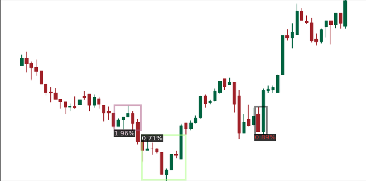
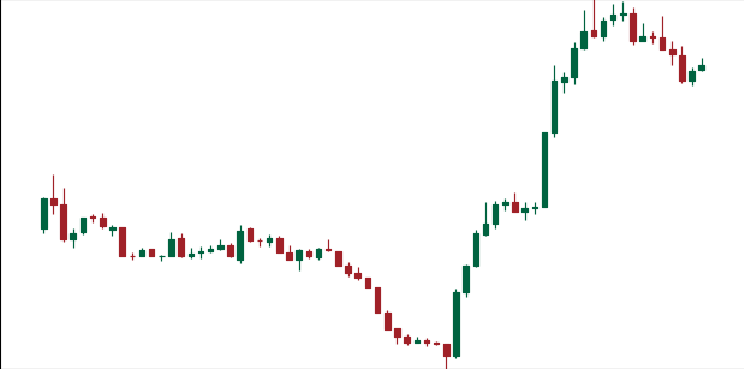
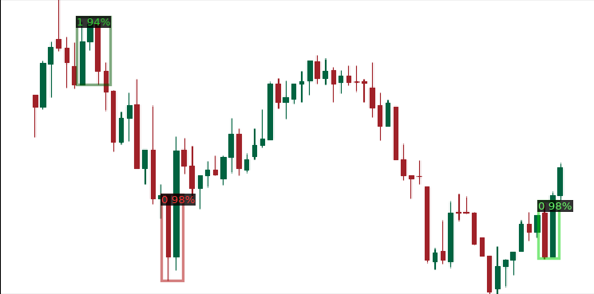
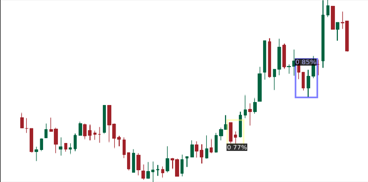
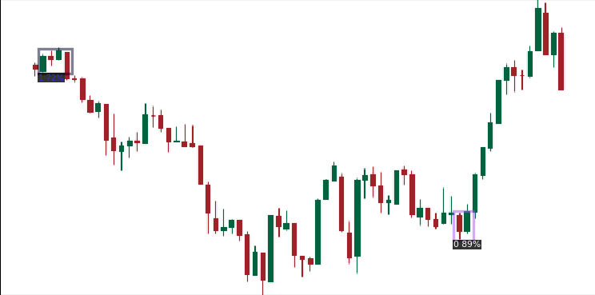
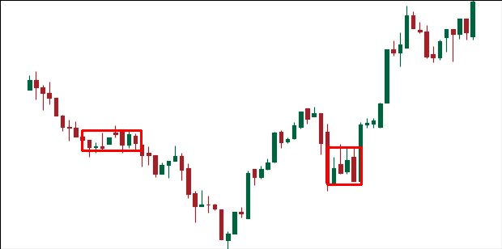
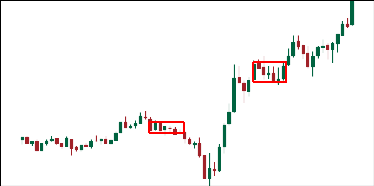
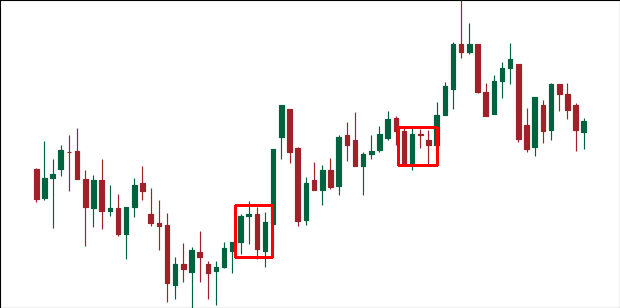
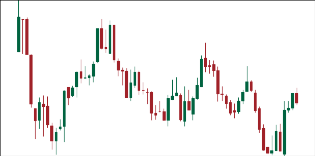
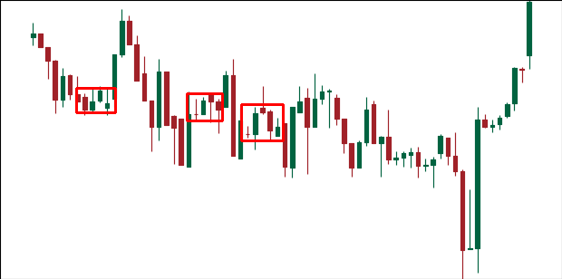

# OHLC Detection Project

Detectron2-based object detection pipeline for OHLC chart images, focused on extracting:
- trading signals (`Buy` / `Sell`)
- price-time ranges (zone detection on chart snapshots)

This repository is production-oriented for **inference** and result export (image overlays + CSV outputs).

## Table of Contents
- [1. Project Scope](#1-project-scope)
- [2. Model Architecture](#2-model-architecture)
- [3. Dataset and COCO Labeling](#3-dataset-and-coco-labeling)
- [4. Repository Structure](#4-repository-structure)
- [5. Setup](#5-setup)
- [6. Model Weights](#6-model-weights)
- [7. Inference Workflows](#7-inference-workflows)
- [8. Output Specifications](#8-output-specifications)
- [9. Sample Results](#9-sample-results)
- [10. Troubleshooting](#10-troubleshooting)
- [11. Notes and Limitations](#11-notes-and-limitations)

## 1. Project Scope

The project processes pre-rendered OHLC candle images and detects meaningful regions using trained object detectors.  
Two inference pipelines are included:

1. **Signal detection** (`scripts/detectron2/show_trained_model.py`)
2. **Range detection** (`scripts/detectron2/run_range_detection_model.py`)

The range pipeline also maps detected pixel coordinates to real-world market values (time/price) using per-image CSV metadata.

## 2. Model Architecture

Both pipelines are based on **Faster R-CNN** in Detectron2.

- Meta architecture: `GeneralizedRCNN`
- Backbone: `ResNet-50 + FPN`
- Proposal network: `RPN`
- ROI head: `StandardROIHeads`

Relevant config files:
- `configs/detectron2/signal_detection/config_final.yaml`
- `configs/detectron2/range_trained/faster_rcnn_R_50_FPN_3x.yaml`
- `configs/detectron2/range_trained/Base-RCNN-FPN.yaml`

Implementation base details:
- Signal model config is a custom Faster R-CNN configuration (2 classes).
- Range model config is built on the Faster R-CNN R50-FPN family and used with a single-class detection setup in inference (`NUM_CLASSES = 1`).

## 3. Dataset and COCO Labeling

Training/finetuning assumptions in this project are aligned with **COCO object detection annotation style**.

- Annotation format: COCO JSON (`images`, `annotations`, `categories`)
- Bounding box convention: COCO-style `[x, y, width, height]`
- Dataset split names used in config: `xau_train`, `xau_val`
- Signal class mapping:
  - `0`: Buy
  - `1`: Sell

Important:
- This repository primarily provides inference scripts and trained-weight usage.
- Raw COCO annotation JSON files and training scripts are not included in the current repo snapshot.

## 4. Repository Structure

| Path | Purpose |
|---|---|
| `configs/detectron2/` | Model configuration files (Faster R-CNN variants) |
| `configs/model_sources.json` | Download sources for `.pth` model weights |
| `data/external/image_input/<year>/` | Input OHLC chart images |
| `data/external/csv_input/<year>/` | Per-image metadata CSVs (used by range pipeline) |
| `data/metadata/predictions/` | Generated predictions (ignored in git) |
| `docs/assets/samples/` | Versioned sample images used in README |
| `models/detectron2/` | Local model destination (weights are not versioned) |
| `scripts/detectron2/` | Inference scripts |
| `scripts/download_models.py` | Model weight downloader |

## 5. Setup

```bash
python3 -m venv .venv
source .venv/bin/activate
pip install -r requirements.txt
python3 scripts/download_models.py
```

## 6. Model Weights

Model files are intentionally excluded from git history.  
They are downloaded using `configs/model_sources.json`.

Configured public sources:
- Range-trained model: https://drive.google.com/file/d/18-NDOWh_VPnmVonfx5rIIREmdwwLI8pS/view?usp=drive_link
- Signal detection model: https://drive.google.com/file/d/1ec8zqmd0eWHFjPiVbmTlF69QoeArulZR/view?usp=drive_link

Download command:

```bash
python3 scripts/download_models.py
```

Optional:
- `--force` to redownload existing files
- `--timeout <seconds>` to adjust timeout

## 7. Inference Workflows

### 7.1 Signal Detection

```bash
python3 scripts/detectron2/show_trained_model.py --no-display
```

Common overrides:
- `--image-dir data/external/image_input/2025`
- `--output-dir data/metadata/predictions/signal_detection`
- `--config configs/detectron2/signal_detection/config_final.yaml`
- `--weights models/detectron2/signal_detection/setup_detection.pth`
- `--score-thresh 0.5`
- `--device cpu` or `--device cuda`

### 7.2 Range Detection

```bash
python3 scripts/detectron2/run_range_detection_model.py --no-display
```

Common overrides:
- `--image-dir data/external/image_input/2025`
- `--csv-dir data/external/csv_input/2025`
- `--output-dir data/metadata/predictions/range_trained`
- `--config configs/detectron2/range_trained/faster_rcnn_R_50_FPN_3x.yaml`
- `--weights models/detectron2/range_trained/model_final.pth`
- `--score-thresh 0.2`
- `--device cpu` or `--device cuda`

## 8. Output Specifications

### Signal Detection Outputs

- Annotated images in the selected output directory
- Detection CSV files under `<output-dir>/csv/`
- CSV columns:
  - `x_min`, `y_min`, `x_max`, `y_max`, `score`, `class_id`

### Range Detection Outputs

- Annotated images in the selected output directory
- Per-image detection CSV files in the same directory
- CSV columns:
  - `x_min`, `x_max`, `y_min`, `y_max`
  - `time_start`, `time_end`
  - `price_high`, `price_low`

`time_*` and `price_*` values are reconstructed from pixel coordinates using metadata in `data/external/csv_input/<year>/`.

## 9. Sample Results

Sample images are stored in `docs/assets/samples` to keep README links stable after push.

### Signal Detection







### Range-Trained Detection







## 10. Troubleshooting

- `Weights file not found`:
  - Run `python3 scripts/download_models.py`.
- Google Drive URL issues:
  - Keep model links in `configs/model_sources.json`.
  - Shared Google Drive links are normalized by the downloader.
- GUI display errors (`cv2.imshow` / headless server):
  - Use `--no-display`.
- Empty predictions:
  - Lower `--score-thresh` and verify the selected model/config pair.
- Missing metadata for range detection:
  - Ensure each image has a matching CSV with the same stem in `--csv-dir`.

## 11. Notes and Limitations

- `data/metadata/predictions/` is ignored in git (generated outputs).
- `detectron2/` directory is ignored at project root to avoid nested-git/submodule conflicts.
- Large `.pth` files in `models/detectron2/` are intentionally not versioned.
